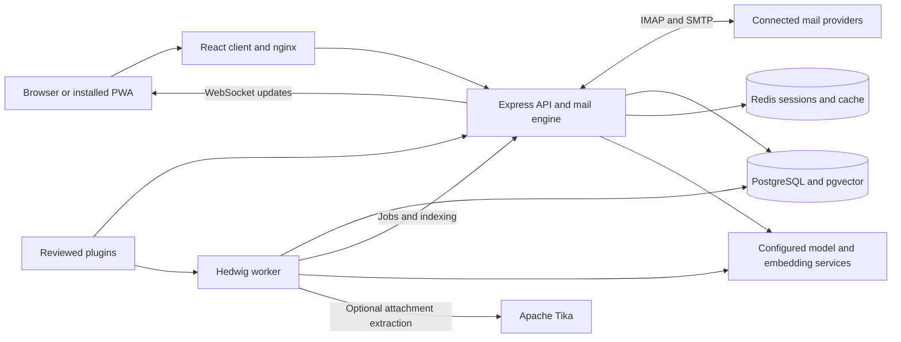

<p align="center">
  
</p>

# Hedwig

**Every inbox, one quiet window.** Hedwig is Team AER’s self-hosted webmail client: connect multiple IMAP/SMTP accounts, keep conversations together, and use mailbox-wide context to decide what needs attention. It builds on [MailFlow](https://github.com/maathimself/mailflow), with gratitude for the mail engine and client that make this possible.

[Get started](#get-started) · [Architecture](docs/hedwig/ARCHITECTURE.md) · [API](docs/hedwig/API.md) · [Plugins](docs/hedwig/PLUGINS.md) · [Contributing](CONTRIBUTING.md)

## What you can do

- **Bring accounts together.** Gmail, iCloud, Microsoft 365, Outlook, and other IMAP/SMTP providers share a unified inbox, threaded reader, rich-text composer, attachments, and account-specific sending. Microsoft accounts use OAuth2; see the [Microsoft setup guide](docs/hedwig/ACCOUNTS-MICROSOFT.md).
- **Read in streams.** People puts correspondence and Needs you together; Reading collects newsletters; Records bundles receipts, deliveries, bills, and notifications. The Screener lets you choose where new senders belong.
- **See why and correct it.** Sorting combines rules, sender history, learned feedback, and configured models. Decisions carry reasons; corrections teach the classifier. Hedwig today records sorting activity with undo controls.
- **Keep track of work.** Reply Later, Set Aside, Snoozed, Waiting on, and Drafts keep unfinished conversations close. The Daily Brief gathers what needs you and what you are waiting for; Records includes Bills and a Ledger for purchases, subscriptions, travel, and deliveries.
- **Ask with context.** Search across accounts, inspect people and topics, follow commitments, and ask questions with message citations. Bodies, attachment names, and optional extracted attachment text feed the index.
- **Use an assistant that asks first.** The built-in agent can look up mail and propose actions or reply drafts. Mutating tools require approval; built-in tools do not send email or permanently delete mail. Scheduled automations use read-only tools. Ordinary compose and mailbox actions remain under your control.
- **Make the workspace yours.** Desktop pane layouts, a phone shell, light/dark themes, keyboard shortcuts, a command palette, and an installable PWA sit alongside the classic mail interface.
- **Extend with plugins.** Per-user activation and permissions support plugin views, commands, hooks, jobs, and agent tools. Receipts, Newsletter digest, Pensieve bridge, and Send guard are included; externally installed plugins require operator review.
- **Manage access.** Admin controls, invitations, two-factor authentication, and OpenID Connect sign-in are inherited from the mail client.

These are implemented surfaces in this repository, matching the product’s landing-page story. Model-backed features depend on your gateway, models, configuration, and mailbox data. The landing page is maintained separately; this repository serves the application and sign-in page, not the marketing site. Design plans and dated audits describe intent or historical findings, rather than release guarantees.

## How it fits together



The API owns IMAP connections and applies database migrations at startup. The separate worker processes stored mail for indexing, context, sorting, briefings, and schedules. Hedwig streams and lists live in its database; explicit mailbox actions, optional inherited workflows, and opt-in confident-spam moves can change IMAP state. Automatic spam moves are disabled by default, logged, and undoable. See [architecture](docs/hedwig/ARCHITECTURE.md) for module contracts and pipeline details.

## Get started

Use Docker and Docker Compose to build the **Hedwig stack from this fork**. The upstream prebuilt images and default `docker-compose.yml` are not the complete Hedwig stack.

```bash
git clone https://github.com/Team-AER/hedwig.git
cd hedwig
cp .env.hedwig.example .env
# Configure .env before starting; see below.
docker compose -f docker-compose.hedwig.yml up -d --build
```

Set `APP_URL` to your public application URL. Generate separate strong values for `SESSION_SECRET`, `DB_PASSWORD`, and `ENCRYPTION_KEY` (`openssl rand -hex 32`). Configure the model/embedding services for your installation, and supply your own Tika endpoint or disable extraction: the compose file contains deployment-specific defaults and does not bundle those services. Detailed configuration, HTTPS, updates, and development instructions are in [Setup](docs/hedwig/SETUP.md).

The frontend listens on HTTPS port 443 and HTTP port 80 by default (`APP_PORT` / `APP_HTTP_PORT`). Its generated certificate is self-signed; use your own certificate or a TLS reverse proxy for a public installation. The first registered user becomes administrator. Then configure registration/invitations and add mail accounts in Settings → Accounts.

## Documentation and development

| Guide | Covers |
| --- | --- |
| [Setup](docs/hedwig/SETUP.md) | Containers, configuration, first login, updates, and local development |
| [Architecture](docs/hedwig/ARCHITECTURE.md) | Processes, modules, pipeline, models, UI, and testing |
| [API](docs/hedwig/API.md) | Hedwig API endpoints and service contracts |
| [Plugins](docs/hedwig/PLUGINS.md) | Manifests, grants, hooks, frontend bundles, and trust boundaries |
| [Microsoft accounts](docs/hedwig/ACCOUNTS-MICROSOFT.md) | Outlook and Microsoft 365 OAuth configuration |
| [Roadmap](ROADMAP.md) | Product direction and the status of planning documents |
| [Contributing](CONTRIBUTING.md) | Development checks and pull requests to this fork |

The backend uses Node.js 22; the frontend uses React and Vite. See [Setup](docs/hedwig/SETUP.md#local-development) for prerequisites and commands. Report issues and propose changes in [Team-AER/hedwig](https://github.com/Team-AER/hedwig/issues).

## Attribution and license

Hedwig is based on **MailFlow by maathimself and its contributors**. Original license, copyright, and contributor notices are retained in [LICENSE](LICENSE), [LICENSE-COMMERCIAL](LICENSE-COMMERCIAL), and [CLA](CLA.md). This fork’s open-source license is **AGPL-3.0**. The retained commercial-license document describes upstream terms; it is not a claim that an upstream commercial purchase licenses Team AER’s additions. Historical MailFlow media remains in `media/` for provenance; the README uses the existing Hedwig owl from the application and landing page.
