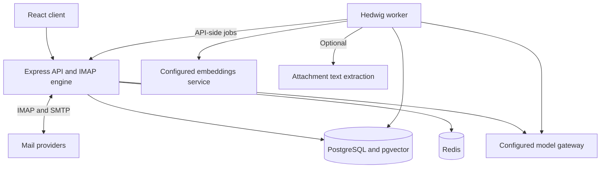

# Hedwig architecture

Hedwig is Team-AER's fork of MailFlow. It builds on the upstream mail client and adds five layers:
a context engine, learning triage, insights, an agent framework, and plugin runtime v2, plus a
pane-tree UI shell. Hedwig modules live primarily in dedicated directories, with explicit integration points in the mail engine and UI.

Start with [Setup](SETUP.md), [API](API.md), and [Plugins](PLUGINS.md). The checked-in
[product PRD](PRD-v2-product.md) and [design build notes](design/REDESIGN-BUILD-2026-09-24.md)
record intent and history; implementation and migrations are the current source of truth.



## Principles (inherited from upstream CLAUDE.md, still binding)

- Mail reliability wins every trade-off. Hedwig code never runs inside IMAP sync paths; it reads
  `messages` after the fact and writes only `hedwig_*` tables (plus `messages.body_*` through the
  body-fetch job, using upstream's own fetch and sanitizer).
- Loud failure beats silent degradation. A failing step records `hedwig_msg.error`, a failing job
  records `hedwig_jobs.last_error`, and `/api/hedwig/admin/health` shows both.
- No permanent mail deletion by the agent. Agent actions that change mail are recorded as
  `hedwig_agent_actions` and wait for user approval. Sorting ordinarily changes database state;
  opt-in `spam.autoMove` can move confident spam to the provider’s Junk folder, with logged undo.
- Everything is configurable (see `backend/src/hedwig/config.js`). Add a knob to `SCHEMA` rather
  than hard-coding a number, a model id, a URL, or a schedule.
- No new npm dependencies without the lead's approval. Everything needed is already installed:
  express, pg, redis, htmlparser2, sanitize-html, react 18, zustand, marked, dompurify, date-fns.

## Processes

| Process | Command | Runs |
| --- | --- | --- |
| API (`backend`) | `node src/index.js` | upstream MailFlow + Hedwig routes, API-side jobs (`mail.fetchBody`, approved agent actions) |
| Worker (`hedwig-worker`) | `node src/hedwig/worker.js` | pipeline scanner, job loop, schedules. No IMAP. |
| Embeddings | configured external provider | `POST /v1/embeddings`, lexical hash vectors, or disabled; dimensions must match the configured profile |
| Models | configured OpenAI-compatible gateway | separate fast, long, and agent roles, with feature routing and budgets |

The API applies migrations at boot (`backend/migrations` then `backend/migrations-hedwig`). The
worker waits for the Hedwig schema before starting.

## Backend layout (`backend/src/hedwig/`)

| File | Owner | What |
| --- | --- | --- |
| `config.js` | lead | Every knob: SCHEMA, `getConfig(userId)`, env → admin → user layering |
| `llm.js` | lead | `chat`, `chatStream`, `chatJson`, `extractJson`, budgets, catalog, clamp, logging |
| `embeddings.js` | lead | `embed(texts)`, `embedQuery(text)`, `embeddingProfile()`, `cosine`, `toVectorLiteral` |
| `jobs.js` | lead | `defineJob(kind, handler)`, `enqueue(kind, payload, {userId, dedupeKey, runAt, priority})` |
| `pipeline.js` | lead | `defineStep({name, order, backfill, run(rows, ctx)})`, scanner, `MESSAGE_COLUMNS`, `decorate` |
| `schedule.js` | lead | `defineSchedule({name, everySec, run})` |
| `hooks.js` | lead | `HEDWIG_HOOKS`, `runHedwigHook`, `collectHedwigHook` |
| `text.js` | lead | `messageText(row)`, `messageHeader(row)`, `addressesOf`, `domainOf`, `stripQuoted` |
| `state.js` | lead | `getState(key)`, `setState(key, value)` |
| `agent/toolRegistry.js` | lead | `registerTool`, `toolsFor`, `toOpenAiTools`, `getTool` |
| `core/` | lead | status, settings, layouts, usage, admin config/health, body fetch |
| `context/` | context agent | entities, embeddings step, topics, extraction, cards, search, ask |
| `triage/` | triage agent | 3-stage pipeline, classifier, feedback, sender stats, waiting-on |
| `insights/`, `agent/` | agent+insights agent | stats, briefings, insight cards, agent loop, automations |
| `pluginsv2/` + `backend/src/plugins/` | plugins agent | manifests, permissions, loader, facade, first-party plugins |
| `sort/`, `labels/`, `work/` | product modules | streams, correction feedback, sorting reasons, and unfinished-work state |
| `indexer/`, `ask2/`, `cards/` | product modules | message/attachment index, cited answers, record cards and ledger data |
| `profile/`, `onboarding/` | product modules | user profile context and onboarding routes |

### Module contract (`modules.js`)

Each `backend/src/hedwig/<module>/index.js` default-exports:

```js
export default {
  name: 'context',
  tools() {},            // registerTool(...) — runs in API and worker
  routes(router) {},     // mounted at /api/hedwig, requireAuth applied; req.session.userId is the user
  adminRoutes(router) {},// mounted at /api/hedwig/admin, requireAdmin applied
  api({ imapManager }) {},// API process only: defineJob for jobs that need the mail engine
  worker() {},           // worker only: defineStep / defineJob / defineSchedule
};
```

Route paths must be namespaced by module: `/context/...`, `/triage/...`, `/insights/...`,
`/agent/...`, `/plugins/...`. Streaming routes use SSE: `Content-Type: text/event-stream`, one JSON
object per `data:` line, blank line between events, a final `{"type":"done"}` event.

### Pipeline order

| order | step | module | backfill |
| --- | --- | --- | --- |
| 10 | `entities` | context | yes |
| 15 | `senderStats` | triage | yes |
| 20 | `embed` | context | no |
| 30 | `triage` | triage | no |
| 32 | `sort` (v2: streams, bundles, needs-you, spam) | sort | yes |
| 34 | `work` (v2: closes Done / Reply Later items and watches when the thread moves on) | work | no |
| 40 | `topics` | context | no |
| 50 | `extract` (enqueues LLM jobs) | context | no |
| 60 | `index` (v2: bodies, Tika, chunks, vectors; runs on the spam folder too) | indexer | yes |

Rows passed to steps carry `MESSAGE_COLUMNS` plus `user_id`, `user_addresses` (Set of the user's
own addresses) and `is_outgoing`. Steps set their `hedwig_msg.*_at` column when done.

History older than `pipeline.backfillDays` (admin, 365) gets only the `backfill` steps when first
seen. How far back the model steps go is per person: `analysis.historyDays` (0 = all mail, the
default; the admin value is the household default). `embed`, `topics` and `extract` cut each batch
to that window, and the `context.analysisCatchUp` schedule (`context/history.js`) runs them on
seen mail inside the window that they never reached, so widening it takes effect on old mail.
Cards, summaries and behaviour labels read the same window. Bodies, chunks and index vectors
always cover all mail. Commitments are not made from mail older than `pipeline.backfillDays`.

### Data model

Hedwig tables and changes are defined by the sequence of files in `backend/migrations-hedwig/`, starting with `h0001_core.sql`. Modules that need more columns add a
new file `h00NN_<module>_<what>.sql` (additive, idempotent: `IF NOT EXISTS`). Never edit h0001 after
it has shipped; never edit upstream migrations.

### Model calls

Always through `llm.js`. Pick a role (`fast` for per-message work, `long` for summaries and answers,
`agent` for tool loops) and a `feature` that has a budget key (`triage`, `extraction`, `summary`,
`ask`, `agent`, `insights`). Plugins pass `pluginId`. Prompts ask for JSON with `json: true` and
parse with `extractJson`; always handle `null`. Every model output that reaches the UI carries the
message ids it came from.

Model capabilities, context limits, and latency depend on your configured provider.
Choose models that support the role’s tool/JSON requirements. `llm.js` normalizes routing and reasoning settings for the gateway.

Configured decision models are called with `llm.systemOne` (`POST /v1/systemone`,
the Ollama/Nimble System One shape). The model's training data is in `llm/decision-models`. The state
text and question wording must match that training data.
- `sort/decision.js` (`aer-laya`, layer `decision`): settles stream, spam and needs-you before Reflex
  when it is confident.
- `sort/guard.js` (`aer-laya-guard`, job `sort.guard`): the rules suspect and the model confirms.
  - It checks new mail from senders the user has no history with, once per message, when the body
    first arrives.
  - It only runs when `sort/spam.js` already sees at least one sign of phishing
    (`sort.guard.requireRuleEvidence`).
  - The model answers safe, spam, scam, phishing, impersonation or malware.
  - A model trained on one mailbox also scores some genuine notices high, so it never acts alone by
    default.
  - The input carries identity lines: sender history, a known person's name from a new address, a
    display name hiding another address, look-alike domains of correspondents, diverted replies,
    link targets and attachments.
  - A confident threat goes to Spam as layer `decision` with `prompt_id` `sort.guard`.
  - Re-sorts leave that verdict alone. Only the user's rules, sender decisions and corrections
    replace it.
  - The guard never lowers a verdict.
  - Spear-phishing evidence is also rule-based, in `sort/spam.js`: `impersonation`, `displayAddress`,
    `payment` and `attachment` signals. It works without the model.
  - Lures that decide whether the model is asked:
    - `credential` and `accountThreat` (block, delete or close an account, storage or files; read in the
      subject and opening only);
    - `prize` bait;
    - `document` (shared-document, invoice and tender wording; adds to the score but is not evidence alone).
  - A lure from a sender whose links go back to its own site weighs little. Genuine service notices
    link home, so they stay below the guard's line.
  - Link evidence: `linkDomain` (a lure whose links all go elsewhere) and `riskyHost` (a lure linking to a
    free page, form or storage host such as storage.googleapis.com or porsline.com, matched by host).
  - `selfAddressed` is delivery evidence: the sender's own address in To, with the user blind-copied.

### Plugin hooks added by Hedwig

`hooks.js` names them. Dispatch sites: `beforeTriage`/`afterTriage` in triage, `onContextBuilt` in
context, `beforeSend` in the send route (plugins agent), `collectInsights` in insights,
`onMessageIndexed` in the pipeline.

## Frontend layout (`frontend/src/hedwig/`)

| Path | Owner | What |
| --- | --- | --- |
| `api.js`, `registry.js`, `store.js` | lead | `hedwigApi`, `hedwigStream`, `registerView`, `registerCommand`, `useHedwig` |
| `shell/`, `theme/`, `icons.jsx`, `index.js` | shell agent | pane tree, templates, layout editor, tokens/themes, palette integration, plugin bundle loader, MailApp integration |
| `views/` | views agent | every Hedwig view (needs-you, context card, ask, timeline, insights, agent, settings pages) |
| `frontend/src/plugins/<first-party>/` | plugins agent | frontend halves of first-party plugins |
| `v2/` | product views | People, Reading, Records, Screener, Daily Brief, Hedwig today, work lists and ledger |

Views register with `registerView` from `hedwig/views/index.js` (imported once by `hedwig/index.js`).
Commands register with `registerCommand`. Cross-pane state lives in `useHedwig`; upstream state
(accounts, selected message, compose) stays in `store/index.js`.

### Design language (v2 "editorial glass", from `docs/hedwig/design/*.dc.html`)

| Token (`--hw-*`) | Light | Dark |
| --- | --- | --- |
| paper (ground) | `#F4F2EC` | `#111214` |
| ink | `#17181A` | `#F2F0EA` |
| muted | `#66696D` | `#A3A6AA` |
| accent (tweakable, `ui.accent`) | `#E0561A` | `#FF7A40` |
| accent-ink (accent as text; 5.3:1 / 7.1:1 on the tint) | `#9E3B0E` | `#FF9A66` |
| accent-tint (slips: deadline, the day's question) | `rgba(224,86,26,.12)` | `rgba(255,122,64,.16)` |
| on-accent (icons on a solid accent fill) | `#FFFFFF` (3.8:1) | `#111214` (7.2:1; white was 2.6:1) |
| glass (sheets) | `rgba(255,255,255,.52)` | `rgba(32,33,37,.55)` |
| edge (sheet border) | `rgba(255,255,255,.72)` | `rgba(255,255,255,.10)` |
| line / line2 (hairlines) | `rgba(23,24,26,.09)` / `.18` | `rgba(255,255,255,.09)` / `.18` |
| tint (selected row) | `rgba(23,24,26,.045)` | `rgba(255,255,255,.05)` |

Small secondary text on an accent-tinted slip uses the ink at 80% (`V.inkSoft`, 8.0:1 light), not
muted (4.3:1 there). A custom `ui.accent` gets `accent-ink` mixed 70% with black and whichever
on-accent (white or the dark paper) contrasts more.

Sheets: `backdrop-filter: blur(var(--hw-blur, 24px)) saturate(1.4)`, 1px edge, radius 26 on desktop
and 28 on phone, over a ground with two blurred light fields (accent top-right, `#3B5A8A` bottom-left).
Type: Instrument Serif for titles and for every reason Hedwig gives (italic), Instrument Sans for
body, DM Mono for times and counts. No pills, no uppercase eyebrow labels, no left-border cards, no
avatars: hairlines, size and one accent do the work; cards are figures (a date, an amount, a time)
with a caption. Inline styles with CSS variables, matching upstream convention. Every interactive
element is a real `<button>`/`<a>`/`<input>` with a label; 44 px targets on phone; keyboard first.

## Testing

Follow [Setup → Local development](SETUP.md#local-development) to configure Node.js 22,
the development database, and `backend/.env`; a private `.env.hedwig-dev` file is not supplied by this repository.

```bash
# backend/
npm test
npm run lint
npm run lint:plugins
node scripts/hedwig-migrate.mjs
npm run test:hedwig-it

# frontend/
npm test
npm run lint
npm run build
```

Unit tests mock the database. Integration tests are guarded by `HEDWIG_IT` and share a
disposable development database, so the integration script runs them sequentially. Tests
must not depend on a production mailbox or a live model gateway.
