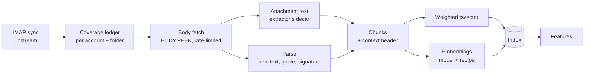

# Hedwig AI Rebuild PRD

Sep 23, 2026 · @Prakhar Shukla

Hedwig's AI has read 8 of your 6,570 messages, and has the body of 1. The rebuild fixes indexing first, ports Pensieve's job, client and feedback patterns second, and only then rebuilds Ask, triage and summaries on top.

## Where it stands

The biggest problem is coverage, not the prompts: the AI never sees most of your mail, and what it does see is a subject line. Counts are from production (LXC 164) on 23 Sep 2026.

| Measure | Value | Why |
| --- | --- | --- |
| Messages in the mailbox | 6,570 (2007 to today) | One account, fully synced |
| Messages the AI pipeline has seen | 8 | The history backfill ran on an empty database before the account was added, marked itself done, and never restarts. Live scanning only looks back 3 days. |
| Messages with a stored body | 1 (3 with HTML) | Upstream syncs headers only. Bodies are fetched on open, or when the embed step asks. |
| Messages with a snippet | 43 | So for most mail the model sees subject and sender only |
| Server spam folder (Bulk) | 786 messages, 120 in the last 3 days | Excluded from the pipeline, so spam learning ignores the best labelled data you have |
| Model calls, Qwen Flash Next | 55 calls, 17 failed, average 88 s | Shared gateway backlog. Gemma answered in 2 to 8 s with no failures. |

**Top problems from the code audit**, most severe first:

1. **Lossy index.** One vector per message from the first 2,000 characters. No chunking, no attachments, nothing older than 365 days. Full-text search covers subject, sender and snippet only.
2. **Naive Ask.** The question becomes an OR of its words plus one vector search. No dates or people are parsed, no reranking, no thread expansion, no relevance floor, and only about 3,000 tokens of evidence on a 262k-token model.
3. **Nothing is versioned.** Commitments, facts, summaries, topics and model triage calls don't record which prompt or model made them, so nothing can be recomputed when either changes.
4. **No quality measurement.** No golden sets or evals anywhere. The topic threshold (0.78) and triage blend weight (0.7) are guesses.
5. **Best-effort structured output.** JSON is scraped out of free text, never schema-checked. Truncated answers are ignored. Failed extractions retry identical calls 5 times.
6. **Two AI stacks.** Upstream's AI provider, categoriser and five separate summarise paths overlap Hedwig's. `/api/ai/chat` accepts client-written system prompts with no budget or user attribution.
7. **Triage decides before the body arrives** and never re-runs.
8. **Model triage lacks context.** It doesn't know who you are, whether you were To or Cc, the thread, or your past corrections.
9. **Only triage learns.** Edits to commitments, facts, answers and summaries teach nothing.
10. **Failures are silent.** Failed pipeline steps are never retried, and briefing fallbacks aren't shown.
11. **Naive topics.** Greedy clusters that never merge or split.
12. **Backend and UI don't line up.** Hybrid search, briefing history and saved answers have no UI. The UI suggests attachment questions nothing can answer.

The plumbing is worth keeping: one gateway client with model fallback, a Postgres job queue, citation mapping, and a per-user triage classifier.

## What we take from Pensieve

Pensieve's AI works because the index is trusted, code does the ranking, every job is visible and retryable, and every correction becomes a signal. We port those patterns into Node rather than copying code, and fix the gaps Pensieve itself still has.

| Pattern | Pensieve | Hedwig today | Hedwig target |
| --- | --- | --- | --- |
| Full-text index | Generated `tsvector` column, weighted title A, text B, archive C, GIN index | Subject, sender, snippet only; body `tsvector` computed at query time | Stored weighted `tsvector` per chunk: subject A, body B, attachment text C, quoted history D |
| Embeddings | Separate table keyed by model; dimension checked; HNSW | Keyed by model only; first 2,000 characters | Keyed by model and recipe version; chunked; backfill finds *missing* vectors |
| Hybrid search | Vector and FTS results joined (no fusion) | Equal-weight RRF, OR query | RRF with tuned weights, date and person filters parsed from the question, a reranker, and a relevance floor |
| Dedupe and clustering | Hash duplicates, series, cosine bands with an LLM check between 0.82 and 0.88, permanent user overrides | Greedy centroids, never merged | Same bands for newsletters and conversations, plus split and merge overrides |
| Job visibility | `ai_jobs` ledger, queued / running / failed counts, Retry rebuilds work from the data, fixed failures stop counting | Queue exists; pipeline step failures never retried | One ledger for every AI unit of work, with reconcile, Retry and a stuck-job reaper |
| Job wrapper | Health check first, defer when gateway down, bounded retries, partial outcome | Retries identical calls 5 times | Health gate, bounded retries with a changed attempt, and `partial` as a real state |
| Gateway client | Strict JSON schema, local validation, per-entry validation for batches, grows `max_tokens` on truncation, `X-Workflow` header, token accounting, `clamp_effort` | `json_object` plus a brace scraper; truncation ignored | Pensieve's contract, plus Hedwig's existing model fallback and priority lanes |
| Batching | 4 to 5 items per call; dropped entries re-run in pairs | One call per message | Batched per-message work; dropped entries re-run on their own |
| Prompts | One file, `PROMPT_VERSION` stored on every row | Inline strings, no version | Prompt registry with versions stored on every output |
| Numbers vs prose | Ranking and trends computed in code; the model only narrates; template fallback | Briefing mostly already this way | Keep it, and show when the fallback was used |
| Eager plus sweep | Summaries written when items arrive; sweep at :05 and :35 repairs gaps | Summaries on demand; no sweep | Thread summaries written on arrival; half-hourly sweep |
| Corrections | One table feeds few-shot examples, profile, cluster overrides and summary rewrite hints | Only triage learns | One corrections table for every AI output |
| Profile | Versioned, user-editable profile with diffs, rebuilt weekly | None | A mail profile: who matters, what you ignore, how you reply |
| Ask | Only from what you read or starred; `[n]` citations; saved answers | Streams; citations; re-runs history and pays again | Keep streaming; show saved answers; check every citation |
| Model choice | Admin Gateway card picks models from the live catalog | Config page exists | Keep; add the catalog picker and an effort clamp |
| Tests | Mock gateway routed by `X-Workflow`; deterministic embeddings | Mocked fetch | Same mocks, plus golden evals (Pensieve has none) |

## Goals and success metrics

The rebuild succeeds when every message you keep is indexed in full, answers are grounded and checkable, and each AI output can be measured, corrected and recomputed.

**Goals**

1. **Full coverage.** Every message in every included folder is indexed, including history, new accounts and folders added later.
2. **Grounded answers.** Ask and the agent answer from the right mail, cite it, and say so plainly when the mail doesn't hold the answer.
3. **Better triage and spam.** Triage and spam decisions use the full message and your history, learn from the server's own spam folder and from your corrections, and change when new evidence arrives.
4. **One AI stack.** Every model call in the app, upstream features included, goes through one client with budgets, attribution, versioning and fallback.
5. **Nothing silent.** Every AI job is visible, retryable, and counted as failed only while its work is still missing.
6. **Measured quality.** Golden sets and evals gate prompt and model changes.

**Non-goals for this rebuild**

- New AI features beyond what the first PRD promised. This is a rebuild of what exists.
- Replacing the model gateway, or training models. Hedwig learns through features, few-shot examples and small per-user classifiers.
- Sending or deleting mail on its own. Actions that change mail still wait for your approval.

| Metric | Today | Target |
| --- | --- | --- |
| Included messages indexed (chunks and vectors) | 8 of about 5,700 | 100% within 24 h of sync; new mail within 2 min |
| Messages indexed with a real body | 1 | At least 98% (the rest flagged with a reason) |
| Ask: right message in the top 10 results (recall@10, golden set) | Not measured | At least 0.85 |
| Ask: claims backed by the cited mail (faithfulness) | Not measured | At least 0.95; says "not found" on at least 90% of unanswerable questions |
| Triage "needs you" precision and recall | Not measured | Both at least 0.85 on your labelled set |
| Spam caught vs the server's Bulk folder; legitimate mail wrongly flagged | Not measured | Catch at least 0.95; wrongly flag at most 0.5% |
| Commitments extracted: precision and recall | Not measured | Precision at least 0.85; recall at least 0.75 |
| AI jobs failed with work still missing after 24 h | Unknown (step failures never retried) | 0 unexplained |
| Model calls per new personal message | About 1.5 to 2.5, unbatched | At most 1, batched |
| Ask time to first token | Minutes on Qwen when backlogged | Under 5 s at p50, on the interactive lane |

## Indexing layer

Every feature reads one index: messages broken into cleaned, versioned chunks, each with a weighted full-text vector and an embedding. The index is built from full bodies and attachment text, and repairs its own gaps.

Each message flows left to right. Every arrow is a job in the ledger (see AI runtime), so any stage can be retried or rerun on its own.

**1. Coverage ledger (replaces the single backfill cursor).** A table `hedwig_index_coverage(account_id, folder, cursor, state, counts)` tracks each folder.

- A new account, a new folder or a folder-rule change starts that folder's backfill automatically. No global "done" flag.
- The scanner works by absence: any included message without a `hedwig_msg` row is due, whatever its age. Newest first; live mail always jumps the queue.
- `pipeline.backfillDays` limits only the expensive model steps (extraction, summaries). Every message is chunked and embedded.
- The server's spam folder (Bulk or Junk) is indexed for spam learning and spam rescue. It never appears in Ask or search unless rescued.

**2. Body acquisition.** Bodies are fetched for every included message, not only when a message is opened.

- Uses upstream's own fetch and sanitiser, with `BODY.PEEK` so fetching never marks mail as read.
- Rate-limited per IMAP host (for example 5 messages a second on 1 connection), and paused while upstream sync is busy. Mail reliability wins.
- Bodies are stored in upstream's `messages.body_*` columns. At today's 6,570 messages the database is 41 MB, so a full body store is small.
- A message that can't be fetched is recorded with a reason (too large, server error), shown in admin health, and retried later.

**3. Attachment text.** The Tika server already deployed on LXC 165 (`10.0.1.69:9998`, Apache Tika 2.9.2 full) turns PDF, DOCX, XLSX, ICS and plain-text attachments into text. On by default, with size and page limits, called from the worker only. Images are out of scope for v1. The endpoint is a config knob (`index.tikaUrl`); use `tika.cls` once the name resolves.

**4. Parsing.** Each body is split into parts: new text, quoted history, signature, disclaimer and tracking junk.

- Handles HTML `<blockquote>`, Gmail and Outlook quote containers, "On ... wrote:" in several languages, `>` lines, "Sent from my iPhone" and common legal footers.
- Quoted history is **kept at low weight**, not deleted. That is what lets "Yes, Friday works" be found together with the question it answers.

**5. Chunks.** A table `hedwig_chunks(id, message_id, kind, ordinal, text, tokens, tsv, recipe)`.

- `kind` is header, body, quote or attachment. Chunks are about 350 tokens, with a 50-token overlap, split on paragraph boundaries.
- Each chunk's embedded text starts with a short context header: subject, sender, date, folder, and attachment name if any. A chunk from deep in a PDF still knows which mail it came from.
- Each thread also gets one rollup chunk (participants, subject, latest state), refreshed when the thread changes.

**6. Full-text.** A stored, weighted `tsvector` per chunk: subject A, new body text B, attachment text C, quoted history D. GIN index. The text-search language is set per user (`simple` plus `english` by default), not hard-coded.

**7. Embeddings.** A table `hedwig_chunk_vectors(chunk_id, model, recipe, dims, vector)` with an HNSW index per model.

- **Model: `bge-m3` on llm-proxy** (`http://llm-proxy.cls/v1/embeddings`, node uranus-embeddings): 1,024 dimensions, 8,192-token input, multilingual. The bundled TEI container and bge-small-en are removed. Pensieve moves to the same route so both apps share one embedding space.
- **Recipe version.** Changing the chunker, the context header or the model bumps the recipe. A sweep re-embeds in the background. Search keeps using the old vectors until the new set is complete, so results never silently shrink.
- **Reranker:** none until llm-proxy has a rerank route. Weighted RRF over full-text and vector results carries retrieval until then.

**8. Scale check.** About 6,570 messages, roughly 4 chunks each, gives about 26,000 chunks, plus the 786 in the spam folder that are now indexed for spam learning. Throughput of the bge-m3 route is unmeasured; the first R1 task is to time a 1,000-chunk batch and set the worker's concurrency from it. Bodies are the slow part: at 5 messages a second, about 22 minutes for one account.

## AI runtime

Every model call goes through one client, runs inside one job ledger, uses a versioned prompt, and writes its provenance next to its output. This is Pensieve's contract rebuilt in Node on Hedwig's existing Postgres queue.

**Job ledger.** Extend `hedwig_jobs` rather than adding a queue.

- **States:** queued, running, done, partial, failed, resolved, retried. Each row stores kind, target, user, attempts, last error, and tokens in and out.
- **Reconcile** runs on every admin-page load and hourly. A failure becomes `resolved` when a later run succeeded or the work now exists in the data.
- **Retry** rebuilds the work from the data ("every message with no chunks", "every thread with no summary"), not from saved arguments.
- **A reaper** re-queues rows stuck in `running` after a worker dies.
- **Pipeline step failures become jobs**, so triage, topics and extraction get the same catch-up that embedding already has.
- **Health gate.** When the gateway catalog doesn't answer, jobs are deferred, not failed, and deferrals don't use up retry attempts. This fixes a known Pensieve bug.

**Lanes and concurrency.** Two lanes per model:

- **Interactive:** Ask, agent chat and compose. It always gets a slot.
- **Background:** indexing, extraction, summaries and briefings.

Limits are held in Redis so they apply across the API and worker processes, not per process. The 45-second fallback to Gemma stays, applied per lane: interactive calls fall back after 8 s without a first token.

**Gateway client contract** (`llm.js`, rebuilt):

- Structured calls send `response_format: json_schema` with `strict: true`, then validate locally.
- Batch calls validate the envelope loosely and each entry on its own. One bad entry never discards the batch.
- `finish_reason: length` is retried with `max_tokens` doubled, up to a cap.
- A parse failure retries once on the same model with the validation error added to the prompt, then once on the fallback model. Never 5 identical retries.
- Every call carries `X-Session-ID: hedwig` and `X-Workflow: <prompt id>`, so llm-proxy can attribute cost by feature.
- `<think>` blocks are stripped in one place for every caller, streams included.
- Budgets count tokens, not calls, and every call carries a user id, including upstream features.
- Reasoning effort is clamped to what the gateway catalog says each model supports (Pensieve's `clamp_effort`).
- Input is fitted to a token budget by a real estimator. The dead `estimateTokens` is replaced.

**Prompt registry.** All prompts live in `backend/src/hedwig/prompts/`, one module per prompt. Each exports an id, a version, the system text, a user template, an output JSON schema, a role and a default token cap. A version bump is a code change reviewed like any other.

**Provenance on every output.** Commitments, facts, summaries, topic labels, triage model decisions and Ask answers each store `prompt_id`, `prompt_version`, `model`, `ai_call_id` and the source message ids. `hedwig_ai_calls` stores a hash of the prompt and, optionally, the full prompt and output (off by default, kept 14 days) to build eval sets from real traffic.

**Recompute.** When a prompt version or model changes, an admin action recomputes outputs made by older versions: newest first, within the budget, keeping the old output until the new one lands. User edits are never overwritten.

## Features

Each feature keeps its current UI but reads the new index, uses the registry and ledger, and records provenance. Where two paths do the same job, one is kept.

### Ask and search: one retrieval engine

Ask, the agent's `search_mail` tool, and the main search box share one engine: `retrieve(query, filters)`.

1. **Understand the question.** Rules handle common phrases ("last month", "from Priya", "with a PDF", "latest"). The fast model is used only when the rules find nothing, and returns a strict JSON query plan: rewritten text, people, date range, folders, has-attachment.
2. **Retrieve.** Full-text and vector search over chunks run in parallel with the plan's filters. Results are fused with weighted RRF and a light recency prior. Weights are tuned on the golden set.
3. **Rerank.** Deferred until llm-proxy has a rerank route; when it does, it must beat "no reranker" on the golden set before it is turned on.
4. **Expand.** Each top chunk brings its neighbouring chunks and the thread message it replies to, so replies arrive with their questions.
5. **Relevance floor.** Below a tuned score, Ask says it found nothing relevant and makes no model call.
6. **Answer.** Up to 24,000 tokens of evidence, grouped by thread, numbered `[n]`. The prompt keeps today's rules: answer only from the numbered mail, cite, and treat mail as data.
7. **Check citations.** Every `[n]` must map to a retrieved message. Answers with no valid citations are labelled "unsupported". The agent's `[msg:id]` format is retired in favour of the same `[n]` mapping.

Ask history shows saved answers instead of re-asking and paying again. A follow-up question carries the previous answer's sources. The main search box gets the hybrid engine behind a toggle, with upstream search as the fallback.

### Triage and spam

- **Decide after the body arrives.** Triage waits for the body (or times out and records that it didn't), and re-runs when the body lands, the classifier retrains, or you reply. Model decisions are no longer locked forever.
- **Better model context.** The stage-3 prompt gets:
  - who you are (name and addresses)
  - whether you were To, Cc or Bcc
  - the last 2 thread messages
  - the sender's history (how often you open, reply and archive)
  - 5 of your own recent corrections as examples
- **Calibrated blend.** The 0.7 blend weight and fixed 0.8 confidence become values fitted on the gathered labels.
- **Spam learns from real labels, and doubts the server.** The server's Bulk folder is a weak label, your moves into and out of spam are strong ones, and the nightly judge adds silver labels. Signals added: SPF, DKIM and DMARC results from `Authentication-Results`, first-time sender, reply-to or link domain that differs from the sender, whether you ever replied to the sender, and similarity to known spam.
- **Spam rescue.** The pipeline runs over the spam folder too. Messages that look legitimate (replied-to sender, passing DMARC, personal tone, an order you placed) are listed in a Rescued view and in the Screener. Rescuing is one tap and teaches the classifier; "always" adds a trusted-sender rule.
- **Spam actions stay reversible.** Hedwig suggests spam and suggests rescues by default. Auto-moving in either direction is opt-in, has a confidence threshold, is logged, and can be undone in one click.
- **One classifier.** Upstream's categoriser (primary, newsletter, promotion, automated, social) is replaced by triage categories, so there is one answer to "what kind of mail is this".

### Summaries

- **One summarise prompt family** replaces the five current paths: per-message TL;DR, thread summary, person and topic summary, newsletter digest item, and the GTD one-liner.
- **Written eagerly:** thread summaries for threads with a real person in them, batched 4 threads per call, with a half-hourly sweep for gaps (Pensieve's pattern).
- **Every sentence cites its messages.** Topic summaries currently don't; that is fixed.
- **Rewrite with a note:** reject a summary, say why, and the note goes into the next prompt and the corrections table.
- Refresh runs as a job. The HTTP request no longer waits up to 240 s.

### Commitments and facts

- Extraction runs per thread update, batched, with a strict schema. It sees the whole new message plus its quoted context from the index.
- Duplicates are matched by embedding similarity, with a model check in the uncertain band, instead of word overlap.
- Confidence is shown. Low-confidence items appear under "maybe" rather than being hidden.
- Edits, dismissals and "done" marks become corrections and feed back as examples.

### Topics

Keep online assignment for new mail, and add a nightly pass that merges and splits topics using the same cosine bands as Pensieve's clustering, with a model check between the bands. Your split and merge actions are permanent overrides. The threshold is set from the golden set, not guessed. Centroid search moves into Postgres, so 2,000 centroids are no longer loaded into JavaScript per batch.

### Briefings

Code keeps computing the numbers; the model only writes the prose. When the template fallback was used, the briefing says so. Briefing history gets its view.

### Agent

- The agent uses the shared retrieval engine and citation check. The weaker fallback tools are removed.
- **Injection guard.** If a run has read any message content, every mail-changing action in it waits for approval, even when auto-confirm is on. Only actions you have explicitly allowlisted skip this.
- Tool results are cut on JSON boundaries, and history is capped by tokens, not message count.

### Upstream AI and plugins

- `/api/ai/chat` stops taking client-written prompts. "Summarize", "Action items", "Translate" and "Reformat" become named server-side actions that use the registry.
- The upstream provider setting remains as a model choice, but its calls go through `llm.js`, so budgets, attribution and fallback apply.
- The plugin facade (`llm.summarize`, `llm.extract`) uses registry prompts with a "treat as data" rule. The digest plugin caches per message.

## Feedback and memory

Every AI output can be corrected in one click, and every correction lands in one table that the prompts, classifiers and profile all read.

**One corrections table.** `hedwig_corrections(user_id, kind, target_id, before, after, note, prompt_id, prompt_version, created_at)`.

| Kind | Captured when you | Used for |
| --- | --- | --- |
| `triage` | Change priority or "needs you"; implicit labels from reply, open and archive | Classifier retraining; few-shot examples in the model prompt |
| `spam` | Move mail into or out of spam | Spam classifier; sender reputation |
| `commitment`, `fact` | Edit, dismiss or mark done | Few-shot examples for extraction; suppressing near-duplicates |
| `summary` | Reject with a note, or rate | The rewrite hint; prompt evals |
| `answer` | Mark an Ask answer wrong or a citation off | Retrieval golden set; faithfulness evals |
| `topic` | Split, merge or rename | Permanent clustering overrides |

The UI gets a small thumbs up or down and "why?" on answers, summaries and briefings. Today only triage and commitments can be corrected.

**Mail profile.** A short, versioned, second-person profile, like Pensieve's reader profile. It is rebuilt weekly from 90 days of behaviour and the latest 30 corrections. It covers:

- who matters: people you reply to quickly, VIP domains
- what you ignore: senders and kinds you archive unread
- how you write: length, tone and sign-off, for compose help
- your standing preferences, in your own words

You can edit it. Your edits are pinned lines the rebuild must keep, a gap in Pensieve. Each version stores a diff, shown as "what changed". Triage, summaries, briefings and compose read it.

**Implicit signals, carefully.** Bulk actions (5 or more messages archived in the same second) count as "skipped", not "read". This is Pensieve's mark-all heuristic, adapted to mail.

## Evaluation

No prompt, model, threshold or recipe change ships unless an offline eval shows it is no worse. The labels come from Hedwig itself, not from labelling sessions. Evals run against the live gateway on demand, never in unit tests.

**Labels without homework.** Three sources, cheapest first; the user is asked only when the first two disagree.

| Source | How | Yields |
| --- | --- | --- |
| Behaviour | Replies, archives, reads, spam moves, sends and unsubscribes are turned into labels by fixed rules (reply within a day = needs-you; archived unread 3 times = not; server spam folder = weak spam; a move into or out of spam = strong) | Continuous, free, weak to strong |
| Judge | Nightly, Qwen labels a stratified sample (folder, sender volume, age) with a rationale; Gemma labels the same sample; agreement with behaviour makes a silver label, disagreement goes to the question queue | About 100 silver labels a night |
| Gentle questions | At most 3 a day, in the brief and inline, one tap each, each carrying its evidence; never asked twice; dropped when other evidence settles it | Gold labels, and rules when the user says always |

**Ask's golden set is generated.** Qwen writes question, answer and source-message triples from real threads; a second pass checks the answer is in the source; the user's "wrong answer" marks are added; unanswerable questions are generated against mail that isn't there.

| Suite | Labels | Metric |
| --- | --- | --- |
| Retrieval and Ask | Generated triples plus user marks | Recall@10, MRR, faithfulness judged by Qwen against the cited chunks, "not found" rate on unanswerable questions |
| Triage | Behaviour plus questions | Precision and recall for needs-you and category |
| Spam and rescue | Server folder (weak), moves (strong), judge (silver) | Catch rate, rate of legitimate mail wrongly flagged, rescue precision |
| Extraction | Judge plus user edits and dismissals | Precision and recall |
| Topics | Judge on thread pairs | Pair accuracy, used to pick the threshold |

**Harness.** `npm run hedwig:eval -- <suite> [--prompt v] [--model m]` writes a report to `hedwig_eval_runs`, reports silver and gold separately, and prints a comparison with the last accepted run.

**Gates.** A prompt or model change may not lower any gold metric by more than 2 points. Spam false positives may not rise at all. Admin health shows the latest eval run per suite and how many gold labels each suite has.

**Unit tests.** Ported from Pensieve: a mock gateway routed by the `X-Workflow` header, deterministic hash embeddings, and checks on prompt contents, batching, retry order and schema validation.

## Plan

Index first, runtime second, evals third, then features in order of how much each depends on retrieval. Phase 0 is a same-day fix; phases 1 to 3 unblock everything else. After phase 3, phases 4 to 6 can run in parallel.

| Phase | Scope | Exit criteria | Size |
| --- | --- | --- | --- |
| 0. Stop the bleeding | Restart the backfill when an account or folder is added; queue body fetches for the last 365 days; show coverage in admin health | Production reports at least 95% of included mail seen and at least 90% with a body | 1 day |
| 1. Index | Coverage ledger, full body fetch, spam folder included, parser, chunks, weighted `tsvector`, chunk vectors on bge-m3 with recipe versions, Tika attachment text | 100% of included messages chunked and embedded; re-index after a recipe bump leaves search working throughout | 1 to 1.5 weeks |
| 2. Runtime | Job ledger states, reconcile, Retry, reaper, health gate, Redis lanes, rebuilt `llm.js` contract, prompt registry, provenance columns, recompute action | Every model call has a prompt id and version; admin shows queued, running and failed; a gateway outage defers jobs without failing them | 1 week |
| 3. Labels and evals | Behaviour labels, the nightly judge, the question queue and its UI, generated Ask triples, harness, eval-run table, gates in admin | Baseline numbers recorded for every suite against today's code, with no labelling session | 1 week |
| 4. Ask and search | Shared `retrieve()`, query plan, weighted RRF, thread expansion, relevance floor, citation check, saved answers, hybrid search box | Recall@10 at least 0.85; faithfulness at least 0.95; p50 first token under 5 s | 1 week |
| 5. Triage, spam and rescue | Body-aware re-triage, richer stage-3 prompt, fitted blend, spam learning with weak server labels plus auth signals, spam rescue view, opt-in auto-move with undo, upstream categoriser retired | Triage precision and recall at least 0.85; spam catch at least 0.95 with at most 0.5% wrongly flagged; rescue precision at least 0.9 | 1 week |
| 6. Summaries, extraction, topics | One summarise family, eager thread summaries with sweep, batched strict extraction, embedding dedupe, nightly topic merge and split | Extraction precision at least 0.85 and recall at least 0.75; at most 1 model call per new personal message | 1 to 1.5 weeks |
| 7. Consolidate and learn | Corrections table and UI, mail profile, agent on shared retrieval with the injection guard, `/api/ai/chat` locked down, plugin facade on the registry | No client-written prompts reach the gateway; every AI output has a correction control | 1 week |

Each phase ships to LXC 164 behind config flags with `deploy/deploy-lxc.sh`, and is checked through `/api/hedwig/admin/health` before the next one starts. Old paths stay until the new one passes its gate, then they are deleted in the same phase.

## Risks and open questions

The largest risk is load on the shared Qwen gateway. The plan reduces model calls per message, but backfilling a year of extraction and summaries is still thousands of calls.

| Risk | Mitigation |
| --- | --- |
| Gateway saturation (Qwen had 11 to 29 queued requests from other clients on 23 Sep) | Background lane capped at 1 in flight; backfill runs at night; Gemma fallback; budgets counted in tokens |
| Fetching every body strains the IMAP server or trips rate limits | Per-host rate limit, `BODY.PEEK`, pause while upstream syncs, newest first |
| A bad prompt change degrades quality unnoticed | Eval gates; recompute keeps old outputs until new ones land |
| Wrong spam auto-moves | Opt-in, confidence threshold, zero-tolerance false-positive gate, one-click undo |
| Indexing quoted history makes answers repeat old text | Quote chunks get the lowest weight; the reranker and thread grouping prefer the newest message |
| Upstream merges conflict with body-fetch and `/ai/chat` changes | Keep changes in Hedwig directories and hooks; touch upstream files only at the two named points |

**Decided on 23 Sep 2026:** everything on llm-proxy (Gemma 4 12B fast, Qwen Flash Next long, bge-m3 embeddings, no cloud); attachments through the Tika server on LXC 165 at `10.0.1.69:9998`; Ask covers all mail except spam and trash; labels are gathered by Hedwig, not in sessions; Reading-to-Pensieve hand-off deferred.

**Still open**

- [ ] `tika.cls` does not resolve yet; register the Kea reservation for 10.0.1.69 so the name works from the LXC.
- [ ] Phase 0 (restart the backfill and fetch bodies) is ready to run on production once you say so; it will send a year of mail through Gemma and Qwen.
