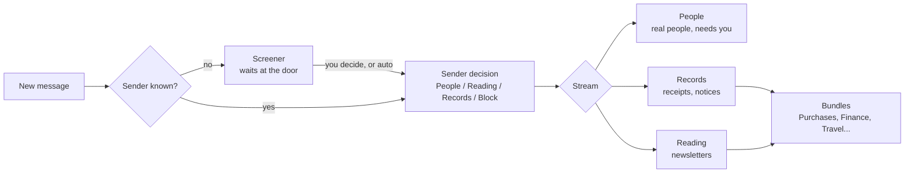
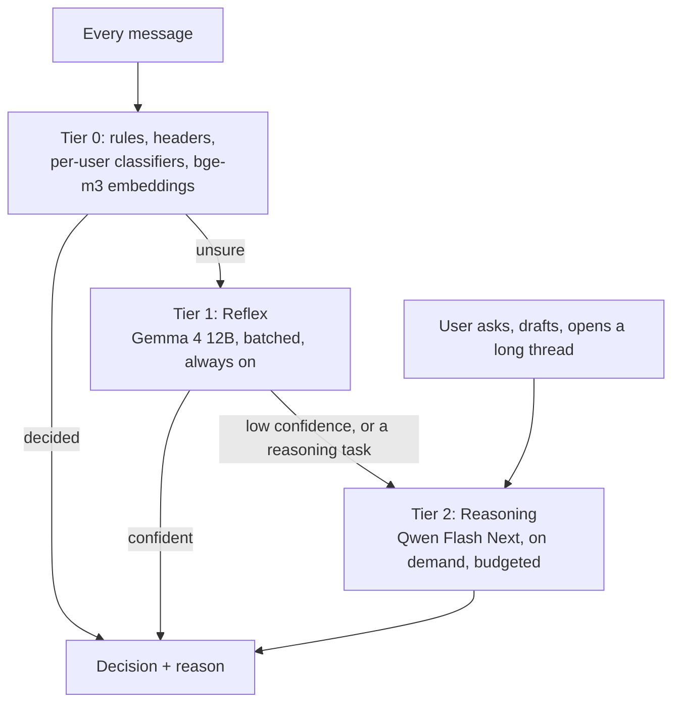

# Hedwig v2 Product PRD

Sep 23, 2026 · @Prakhar Shukla

Hedwig reads all your mail so you only see what needs you: first-time senders wait at the door, everything else sorts itself into streams and bundles with a stated reason, and a small always-on model does the sorting while a large model is reserved for thinking. Most people never open a setting; power users can change every rule, model and pane underneath.

## Vision and principles

Hedwig is for two people at once: the one who wants mail to just be sorted, and the one who wants to change how. Both get the same product. The difference is how far they open it.

**The Simple user** opens Hedwig and sees three things: what needs them, what's waiting on others, and a short brief of everything else. Every sorted message says why it went where it did, in one line, and offers one tap to change it. They never open Settings.

**The Power user** opens the same screens, then presses a key. Underneath every automatic decision is a rule they can read, edit or replace; every model call names its prompt and model, and both can be swapped; every pane can be rearranged; and everything is a plugin API. Hedwig is meant to be lived in and extended, like Emacs for mail with better defaults.

**Principles**

1. **Decide, then explain.** Hedwig acts on its own for sorting, bundling and screening, and always shows the reason. Actions that change mail (send, delete, move to spam) wait for the user unless they have opted in.
2. **Every correction teaches.** Changing a decision creates a rule, a training label, or both. The user never has to say the same thing twice.
3. **Small model always, big model rarely.** A small local model reads every message. The large model is called for questions, drafts and hard cases only, on a budget.
4. **Nothing is lost, nothing is silent.** Hedwig never deletes on its own; the owner can delete (to Trash) and undo. Every AI job is visible, retryable, and versioned so it can be redone.
5. **The mailbox is the source of truth.** Hedwig's sorting lives in its own tables and can be rebuilt from IMAP at any time. Leaving Hedwig loses nothing.
6. **Simple has no settings; Power has all of them.** Any feature must work with zero configuration and expose every knob.

**What Hedwig borrows, and from where**

| From | Idea | Hedwig's version |
| --- | --- | --- |
| Hey | Screener, three streams, Reply Later, Set Aside, Focus and Reply, notes and clips, tracker blocking | Screener with AI pre-decisions; People, Reading and Records streams; the same workflows, unified across accounts |
| Google Inbox | Bundles, cards (flights, purchases), pins, snooze, reminders, scheduled bundle delivery, "Done" | Bundles inside streams; card types as plugins; delivery schedules |
| Gmail | Nudges, smart reply, importance markers, filters | Waiting On, quick replies in your voice, the rules engine |
| Superhuman | Keyboard-first, split inboxes, instant everything | Command palette and splits, already in the shell |
| Pensieve | Completeness: job ledger, retry chains, profile, evals, corrections as signal, the daily paper | The whole completeness layer, and the Reading stream reads like Pensieve |

## Sorting mail: Screener, Streams, Bundles

Every message answers two questions in order: *is this sender allowed in?* (the Screener), then *what kind of mail is it?* (a Stream, and a Bundle inside it). Both answers come with a reason and a one-tap override.

A sender's decision is remembered and applies to their future mail. Streams and bundles are decided per message, so one sender can produce both a receipt and a real question.

### The Screener

First-time senders don't reach the inbox. They wait in the Screener until you decide once: **People**, **Reading**, **Records** or **Block**.

- **Pre-decided.** Hedwig proposes a decision and a reason for every waiting sender: "Mailing list from a domain you've bought from", "Replied to your own mail", "Newsletter, List-Unsubscribe header". Accepting is one tap; the whole batch is one tap.
- **Auto-screen is on for everyone.** Senders Hedwig is confident about are let through to the right stream and listed in a **Screened today** log with an undo on each. Doubtful ones wait. Confidence comes from the Reflex model, sender reputation and whether you have ever written to them.
- **Decisions by scope.** A decision can apply to the address, the domain, or the List-ID. Hedwig suggests the widest scope that is safe.
- **Always in:** anyone you have sent mail to, anyone in your contacts, and replies to your threads.
- **In spam but looks real.** Mail the server put in its spam folder that Hedwig thinks is legitimate appears here too, marked as such, so a wrongly filed sender is rescued at the same moment they are screened.

### Streams

Three default streams, named for what is in them. Streams are unified across all accounts.

| Stream | Holds | How it reads |
| --- | --- | --- |
| **People** | Mail from real people, and anything that needs you | A list of threads, newest first, with Needs You on top |
| **Reading** | Newsletters, digests, blogs | A reading view: scroll, skim, one story per issue, like Pensieve; nothing is marked unread |
| **Records** | Receipts, confirmations, notifications, statements | Bundled and searchable; you rarely open it, cards do the work |

Power users can add streams (for example **Work** and **Personal** split by account, or **Family**) and set a stream's reading mode, notification rule and delivery schedule.

### Bundles

Inside Reading and Records, mail is grouped into bundles, Google Inbox style. Default bundles: **Purchases**, **Finance**, **Travel**, **Deliveries**, **Social**, **Updates**, **Promotions**, **Forums**, **Calendar**.

- **Delivered on a schedule.** A bundle can arrive as it happens, once a day at a chosen time, or once a week. Promotions default to once a day at 7 pm; Finance to as it happens.
- **Custom bundles by description.** "Everything about the house renovation" or "Mail from my kid's school" becomes a bundle. The model classifies against the description; you can pin rules under it.
- **Bundles collapse to one line** with a summary ("3 deliveries, 1 arriving today") and expand in place.

### How the sort is decided

The decision stacks three layers, cheapest first. Each layer can decide outright or pass down with its confidence.

1. **Rules and headers.** Your rules, sender decisions, List-ID, Precedence, Auto-Submitted, calendar MIME types, known-sender lists. Deterministic, instant, explainable.
2. **Per-user classifier.** Small models trained on your own history and corrections: sender stats, reply behaviour, the words in the subject, authentication results.
3. **Reflex model** (Gemma 4 12B on llm-proxy). It reads the message and returns stream, bundle, needs-you, spam verdict, a confidence, and a one-line reason, in one JSON answer. It sees the whole message, who you are, your relationship with the sender, and your last corrections as examples.

Only when the Reflex model's confidence is low does the message go to the large model (see the model architecture section). Every decision stores the layer that made it and its reason.

**Corrections.** Moving a message to another stream or bundle asks one question: "Just this one, or always for this sender / list / kind?" "Always" creates a rule the user can see and edit. Every correction also becomes a training label.

## Cards: structured mail

A lot of mail is data wearing a message. Hedwig pulls the data out and shows a card, so a flight is a boarding time, a receipt is an amount, and a delivery is a date, without opening anything.

**Where cards show**

- At the top of a message and its bundle row ("Arrives Thursday · DHL").
- In the Daily Brief ("2 deliveries today, 1 invoice due Friday").
- In the **Ledger** views: Purchases, Subscriptions, Travel and Deliveries as tables you can sort and export. This is where "what did I spend on subscriptions this year" gets answered without a model call.
- On a person or company card ("Last order 12 Aug, £48").

**Card types in v2**

| Card | Fields | Source |
| --- | --- | --- |
| Receipt / order | merchant, amount, currency, items, order id, date | Schema.org markup when present, then the model |
| Invoice / bill | issuer, amount, due date, paid state, PDF | Attachment text from Tika + model |
| Subscription | service, amount, cadence, next renewal, cancel link | Recurring receipts grouped by merchant |
| Delivery | carrier, tracking number, status, expected date | Carrier patterns; status refreshed from later mails |
| Flight / train / hotel | route, times, booking ref, seat | Schema.org, then model |
| Event / invite | title, time, place, RSVP state, .ics | Calendar MIME parts |
| Security / account | which account, what changed, one-time code | Patterns; codes shown large and copyable |
| Deadline / request | what, by when, from whom | Model extraction, the same as commitments |
| Newsletter issue | title, stories, read time | The Feed's reading view |

**Rules for cards**

1. **Deterministic first.** Schema.org JSON-LD, .ics parts, carrier tracking formats and known merchant templates never need a model. The Reflex model fills the rest; the large model is used only for messy invoices.
2. **Every field shows its source.** Tap a field to see the sentence or attachment it came from. Wrong fields can be edited, and the edit is a correction.
3. **Cards are plugins.** A card type is a manifest: a detector, an extraction schema, a renderer and optional actions ("Track", "Add to calendar", "Pay"). Third parties can add card types; first-party ones use the same API.
4. **Cards trigger actions, never silently.** "Add to calendar" and "Set a reminder for the due date" are offered on the card. Users can make them automatic per card type.

## Working the inbox

People is a to-do list you didn't write. Hedwig keeps it short by splitting it into what needs you now, what you chose to handle later, and what you are waiting on, and by making "done" a real state.

**Needs You.** The top of People. A thread is here when someone asked you something, a deadline is near, or a reply is overdue. Each row carries a reason chip ("Asked for the report by Fri", "Waiting 4 days"). Nothing else in People demands attention.

**Done.** Every thread has a done state, like Google Inbox. Done threads leave People, stay searchable, and come back if someone replies. Sweep marks a whole day done in one key.

**Reply Later** (Hey). A stack of threads you intend to answer. It sits at the bottom of People so it can't be forgotten, and opens in **Focus and Reply**: one screen, all the threads, reply boxes ready, a draft in your voice pre-filled if you want one.

**Set Aside** (Hey). Threads to keep at hand without answering: tickets, references, a thread for tomorrow's meeting. Shown as a small tray, never counted as unread.

**Snooze.** Hide a thread until a time, until a reply arrives, or until a card's date (the day before the flight). Snoozed mail returns to the top of People with a "back from snooze" chip.

**Pins and Reminders.** Pin a thread to keep it at the top. Add a reminder to any thread or to nothing ("Call the dentist"), and reminders appear in People like mail. This is what makes People the only list you check.

**Waiting On.** The other half of Needs You: things you asked others for. Hedwig tracks the ask from your sent mail ("Can you send the contract?"), watches for the answer, and after a chosen time offers a **nudge** with a drafted follow-up. Resolved when the reply lands, or when you mark it.

**Bulk actions from the row.** Unsubscribe, block, move to Reading or Records, and "always do this" are one key from any row. Unsubscribe uses the List-Unsubscribe header first and never opens a web page unless it must.

**Keyboard and command palette.** Every action has a key and a palette entry (already in the shell). Simple users get a short hint bar; Power users can rebind everything.

**Notifications.** By default, only Needs You from people notifies. Reading and Records never do. Per-stream, per-person and quiet-hours rules live underneath.

## Context and memory

Hedwig remembers your mail so you don't have to re-read it. Context is built once, kept current, and shown where you need it: on a person, on a thread, in a question, and in a morning brief.

**People and company cards.** Every sender has a card: who they are, which company, how you know them (first mail, last mail, how fast you each reply), open items between you, recent threads, attachments they sent, and a two-sentence summary that cites the mail it came from. Companies group their people, and their receipts and invoices.

**The story so far.** Opening a long thread shows a short summary of what happened since you last looked, with each sentence linked to its message. Long threads get a collapsible timeline (decisions, asks, attachments) instead of a wall of quotes.

**Ask.** A question box that answers from your mail with numbered citations, over all accounts. "What did the landlord say about the deposit?" "Which attachments did I send Maria last month?" "How much did I spend at Amazon in June?" The last one is answered from cards, not the model. Answers are saved, follow-ups keep context, and every answer can be marked wrong. When the mail doesn't hold the answer, Ask says so.

**The Daily Brief.** A single page each morning, compiled like Pensieve's paper: no waiting on a model, with prose only where it helps.

1. Needs you today, with reasons
2. Waiting on others, with suggested nudges
3. Today's cards: deliveries, events, bills due
4. Reading's best stories, one line each
5. What Hedwig screened and sorted, in numbers, with an "undo any of it" link

Delivery time and sections are per user. It can also be sent as a mail to yourself.

**Notes, clips, renames and merges** (Hey).

- **Notes** on any thread, private, searchable, included in Ask.
- **Clips**: select any text in a message and save it. Clips are searchable and grouped by thread and person.
- **Rename** a thread's subject for yourself ("Re: Re: Fwd: stuff" becomes "Lease renewal").
- **Merge** threads that belong together; **split** ones that don't.

**Memory profile.** A short, versioned profile of how you use mail: who matters, what you ignore, how you write, standing preferences in your own words. Rebuilt weekly from behaviour and corrections, editable, with a diff of what changed. It feeds sorting, drafting and the brief.

## Writing

Hedwig helps you answer faster without sounding like a machine. It learns your voice from your sent mail and only ever offers, never sends.

- **Drafts in your voice.** "Draft a reply" writes from the thread, your profile and your past replies to this person: your length, greeting, sign-off and tone. Drafts are marked as drafts until you edit or send.
- **Quick replies.** Two or three one-line answers under a message when a short reply fits ("Yes, Friday works."). Tap to insert, not to send.
- **Intent to draft.** Type what you want to say in five words ("decline politely, suggest next month") and get a full draft.
- **Rewrite controls.** Shorter, friendlier, firmer, fix grammar, translate. Each shows a diff, not a replacement.
- **Send guard.** Before sending, Hedwig checks for a missing attachment you mentioned, a wrong recipient (a personal thread going to a work domain), a reply-all to a large list, an empty subject, and anything you asked it to watch for. Warnings, never blocks.
- **Scheduled send and undo send.** Send later at a chosen time or "when they're awake" (their time zone from past mail). A 30-second undo on every send.
- **Follow-up on send.** "Remind me if no reply in 3 days" as a checkbox on the compose window. That creates a Waiting On item.
- **Identities.** Send from any account with the right signature and default reply-from, chosen automatically from the thread.

## Privacy and spam

Hedwig blocks what watches you and learns what you consider junk. The server's spam verdict is one signal among several, because today it is wrong in both directions: real mail sits in the spam folder and junk reaches the inbox. Spam handling is reversible by design.

**Tracker blocking.** Tracking pixels are stripped from every message before it renders, and the message shows "1 tracker blocked · Mailchimp". Link redirects through tracking domains are unwrapped to the real destination. Remote images load through Hedwig's proxy, or not at all for senders you haven't allowed.

**Learned spam.** Spam is a stream decision, not a black box.

- Training data: the server's spam folder as a *weak* label, every move you make into or out of spam as a strong one, the Screener's blocks, and the judge model's verdict on a sample (see Completeness).
- Signals: SPF, DKIM and DMARC results, first-time sender, reply-to and link domains that differ from the sender, lookalike domains, known-phishing patterns, whether you have ever replied to the sender, and similarity to mail you already marked.
- The Reflex model reads doubtful mail and returns spam, phishing or clean, with a reason.
- **Phishing** gets its own treatment: a red banner on the message, links disabled until you allow them, and the sender's real domain spelled out.

**Spam rescue.** Hedwig reads the server's spam folder too (786 messages today). Anything that looks legitimate, such as a sender you have replied to, a passing DMARC check, a personal message, an order you placed, appears in a **Rescued** view and in the Screener as "in spam but looks real". One tap moves it to its stream and marks the sender as trusted; "always" adds a rule. At Sort the past, the count is shown up front ("786 in spam, about 30 look real").

**Actions.** By default Hedwig marks suspected spam and leaves it in a **Suspected** view for 30 days, and suggests rescues rather than moving them. Auto-moving in either direction is opt-in with a confidence threshold, a log, and one-tap undo. Hedwig never deletes on its own; the owner can delete (to Trash) and undo.

**Blocked senders.** Blocking hides a sender forever without unsubscribing or bouncing. Blocks apply to address, domain or list, and are listed under Screener with an unblock button.

**Data stays home.** All models run on llm-proxy inside the cluster. Nothing about your mail leaves the LAN.

## Two-tier model architecture

A small model reads everything; a large model thinks about a little. Everything runs on llm-proxy: Gemma 4 12B as the small tier, Qwen 3.8 Flash Next as the large tier, and bge-m3 for embeddings. No cloud provider.

Read top down: most messages stop at Tier 0 or Tier 1. Tier 2 is reached by escalation or by the user.

**The gateway, as of 23 Sep 2026** (`http://llm-proxy.cls/catalog.json`):

| Role | Model | Node | Limits that shape the design |
| --- | --- | --- | --- |
| Tier 1 Reflex | `google/gemma-4-12B-it-qat-w4a16-ct` | atlas-vllm | 131k context, 4,096 output tokens, no tool calling, reasoning `none` or `high`. So Reflex uses strict JSON output, never tools, batches sized under 4k output, reasoning off. Runs on a different node from Qwen, so it never queues behind Qwen's other clients. 2 to 8 s per call today, no failures. |
| Tier 2 Reasoning | `Qwen/Qwen3.8-Flash-Next` | dgx-spark | 262k context, 32k output, tools, efforts off / low / medium / xhigh. Shared with other clients; today's 45-second fallback to Gemma stays. |
| Embeddings | `bge-m3` | uranus-embeddings | 1,024 dimensions, 8,192-token input, multilingual. Replaces the bundled TEI container; Pensieve moves to the same route. |
| Reranker | none yet |  | Hybrid full-text plus vector fusion until llm-proxy has a rerank route. |

**Tier 0: no generation.** Rules, headers, sender decisions, per-user logistic classifiers, sender statistics, embeddings. Instant, free, explainable. This tier alone sorts a large share of mail.

**Tier 1: Reflex.** Gemma reads every message that Tier 0 couldn't settle.

- Jobs: screening proposals, stream and bundle, needs-you, spam and phishing verdicts, spam rescue, card fields for clean mail, quick replies, thread summaries for short threads, Ask's query plan, duplicate confirmations, judge-agreement labels.
- One JSON answer per message covers every label at once; batched 4 to 6 messages per call, temperature 0, output kept under 4k tokens.
- Targets: under 2 s per message in a batch, under 500 ms for a query plan, 100% of mail covered.

**Tier 2: Reasoning.** Qwen handles what needs thought.

- Jobs: Ask answers, drafts in your voice, the story so far on long threads, messy invoices, the memory profile, the brief's prose, judge labelling of samples, generating Ask golden questions, and anything Tier 1 escalated.
- On demand or by escalation only, on the interactive lane for user-facing calls and the background lane for the rest, with a per-user daily token budget and a night window for backfills.
- Targets: first token under 5 s for Ask and drafts; escalations under 10% of messages.

**Routing policy.** A table, set by the admin and readable by everyone, decides tier by feature: which tier handles it, when to escalate, and the budget. The defaults:

| Feature | Tier | Escalate to Tier 2 when | Cadence |
| --- | --- | --- | --- |
| Screener, stream, bundle, needs-you | 0 then 1 | Confidence under 0.6 | Every message |
| Spam, phishing, rescue | 0 then 1 | Phishing suspected under 0.8, or rescue candidate under 0.7 | Every message, spam folder included |
| Cards | 0 then 1 | Fields missing after Tier 1, or a PDF invoice | Every message with data |
| Thread summary | 1 | Thread longer than 8 messages | On arrival, sweep hourly |
| Quick replies | 1 | Never | On open |
| Ask | 2 (plan by 1) | Always | On demand |
| Drafts, rewrite | 2 | Always | On demand |
| Daily Brief prose | 2 | Always, with a template fallback | Once a day |
| Memory profile, judge labels | 2 | Always | Weekly, nightly sample |

**Fallbacks.** If Gemma is down, Tier 0 sorts and the rest queues; nothing waits on a model. If Qwen is down or slow, Gemma answers with a "lighter model" label, as the 45-second fallback does today. Every output records the tier and model that produced it.

**Operations.** The admin picks the model for each tier from the gateway catalog. Reasoning effort is clamped to what the catalog allows for that model. A dashboard shows calls, tokens, latency and escalation rate per feature, from the `X-Workflow` header the gateway records.

## Simple by default, powerful underneath

There is one Hedwig. Simple users see decisions with reasons; Power users see the machinery behind each reason; the admin sets what the household runs on. The bridge between them is that every reason is a door.

**Simple mode** (the default)

- Zero required settings. Connect an account and Hedwig sorts the past and starts.
- The Settings page has five switches: auto-screen, bundle delivery times, notifications, auto-move spam, and "help me write".
- Every automatic decision shows a one-line **why** chip. Tapping it offers **Change this** (just this one, or always) and nothing more.
- **Hedwig today**: a plain count of what it did ("Screened 12 senders, bundled 40, rescued 2 from spam, blocked 3 trackers"), with undo on each.

**Power mode** (a toggle in the palette, remembered per user)

1. **Rules engine.** Ordered rules with conditions and actions. Conditions cover headers, sender, account, attachments and, new, model predicates: `kind is invoice`, `confidence under 0.7`, `matches "about the house renovation"`. Actions: stream, bundle, label, snooze, notify, run a plugin, call a webhook. Every rule can be **dry-run against history** ("would have matched 213 messages, 4 of them now in People"). Rules created from corrections appear here, editable. Gmail filters and Sieve scripts import.
2. **Views and layouts.** Any search is a saved view with its own pane. Split inboxes, the pane tree, templates and per-view keyboard order come from the current shell.
3. **Model choices, within the admin's bounds.** A user can pick reasoning effort and per-feature budgets for themselves, and choose among the models the admin has enabled. Model endpoints, the routing table's defaults and prompt versions are admin settings.
4. **Data.** Export everything Hedwig derived as JSON, rebuild the index, delete derived data, or reset a feature's learning, for your own account only.
5. **Plugins.** Everything Hedwig itself does is done through the plugin API: card types, streams, rule conditions and actions, brief sections, palette commands, views, send-guard checks. The admin installs plugins; each user grants them permissions. A directory lists first-party and community plugins.
6. **Keys and themes.** Every key rebinds. Themes are token files.

**Admin** (system level, one person for the household)

- Gateway endpoints, the model for each tier, the routing table, prompt versions and their eval gates, the Tika endpoint, registration, and which plugins exist.
- Household users, their budgets and their per-user overrides. The admin never sees a user's mail.

**Progressive disclosure, in practice**

| Simple sees | Power finds behind it |
| --- | --- |
| "Bundled: Purchases · receipt from Amazon" | The rule or model call, its confidence, and a Change to rule button |
| "Screened: newsletter, List-Unsubscribe" | Sender decision scope (address, domain, list) and the Tier 1 reason |
| "Rescued from spam: you replied to them in May" | The spam signals with their weights, and the server's verdict beside Hedwig's |
| An Ask answer with citations | Retrieved chunks and scores, the prompt version, the model, a re-run with another model |
| A draft | The profile lines it used, the tone controls, the prompt |
| "3 trackers blocked" | The tracker list and per-sender image policy |

**Guard rails for both.** Nothing in Power mode can make Hedwig delete mail or send without confirmation, except rules the user writes for exactly that, which show a warning when saved.

## Onboarding and multi-account

The first ten minutes decide whether Hedwig feels magic or like homework. Hedwig sorts your past before you look at it, then asks for five minutes of review.

**Sort the past.** After an account connects, Hedwig indexes history and runs Tier 0 and Tier 1 over all of it, newest first, while you watch a progress card. When done it presents one screen: "Sorted 6,570 messages: 312 people in People, 41 newsletters in Reading, 1,900 receipts in Records, 786 in spam, of which about 30 look real." Below it, the 50 highest-volume senders with their proposed decision and the rescue candidates, for a quick review. Anyone you have ever replied to is already in **People**.

**Features light up as the index fills.** Search, cards and Ask each show what share of mail they cover until indexing is complete. Nothing pretends to know what it hasn't read.

**Accounts.** Any IMAP account, plus Gmail and Microsoft through OAuth, as upstream supports today. Each account gets a colour dot. Streams are unified by default; a Power user can split any stream by account or keep an account entirely separate (work and personal).

**Identities.** Replies go out from the account that received the mail, with its signature. New mail picks the identity from the recipient's history. Aliases and send-as addresses are supported per account.

**Import and export.** Gmail labels and Hey decisions can be imported as bundles and screener decisions. Everything Hedwig learns can be exported, and re-imported into another Hedwig.

**Household.** One install serves several people. Each person has their own accounts, streams, rules, learning, profile, plugin grants and budget, and never sees anyone else's mail. The admin handles the system level: models, routing, prompts, plugins, endpoints and who can register. Registration is by invitation once the first admin exists.

## Completeness: Pensieve's bar

A feature is done when it survives the model being down, the user disagreeing with it, and the prompt being changed a month later. Pensieve gets this right, and Hedwig adopts the whole layer. The engineering detail is in the [Hedwig AI Rebuild PRD](https://claude.ai/code/artifact/85d06981-4d2b-4527-8c6b-26aee9f5f25b).

| Requirement | What it means for every AI feature |
| --- | --- |
| Full index | Every message in every included folder, spam folder included, body and attachments (through Tika) chunked, full-text indexed and embedded with bge-m3; coverage shown per folder |
| Job ledger | Every unit of AI work is a row with a state: queued, running, done, partial, failed, resolved. Failed counts only while the work is still missing. One Retry button rebuilds work from the data |
| Retry chain | Retry at the call (once with the error shown, then the fallback model), the batch entry, the job, the sweep, and the user's own button |
| Degrades safely | Every AI path has a non-model fallback: rules-only sorting, a template brief, cards from markup, full-text-only search |
| Provenance | Every output stores its tier, model, prompt version, call id and source messages; every field on a card shows its sentence |
| Corrections as signal | One corrections table feeds rules, training labels, few-shot examples, the profile and rewrite hints |
| Recompute | A prompt or model change can recompute old outputs, newest first, without touching user edits |
| Labels without homework | Quality is measured on labels Hedwig gathers itself (below); no labelling sessions |
| Evals | A harness with gates on those labels; no prompt or threshold ships on a hunch |
| Visible cost | Calls, tokens, latency and escalation rate per feature, per tier, per day |
| Idempotent | Deterministic job ids, upserts, coverage ledgers; re-running anything is safe |

### Labels without homework

Hedwig builds its own labelled sets from three sources, in order of cost, and only asks the user when the first two disagree.

1. **Behaviour** (free, continuous). A reply within a day means needs-you and People. Archiving a sender unread three times means not needs-you. Reading for more than 30 seconds means engaged. Moving mail into or out of spam is a strong spam label; the server's spam folder is a weak one. Sending to someone makes them People. Unsubscribing marks Reading or Records.
2. **Judge** (nightly, Tier 2). Qwen labels a stratified sample of mail, by folder, sender volume and age, with a one-line rationale. Gemma labels the same sample. Where they agree with each other and with behaviour, the label is silver. Where they disagree, or either is unsure, the item joins the question queue.
3. **Gentle questions** (at most 3 a day, in the brief and inline). Each carries its evidence and takes one tap: "You've replied to Anna 14 times, usually within an hour. Keep her mail in People?" "This newsletter has gone unread for 12 issues. Deliver it weekly instead?" "This was in spam, but you ordered from them in May. Rescue it?" An answer is a gold label and, when the user says always, a rule. The same question is never asked twice, and a question is dropped when other evidence settles it first.

**Ask's golden set** is generated: Qwen writes question, answer and source-message triples from real threads, a second pass checks the answer is really in the source, and every "this answer is wrong" mark from the user is added. The unanswerable questions come from the same generator, aimed at mail that isn't there.

Evals report silver and gold separately. Two weeks of normal use yields roughly 300 gold triage labels, 1,000 silver spam labels with rescue candidates, and 60 Ask triples, with no labelling session.

## Roadmap

Four releases. Each one is usable on its own, and each proves one claim before the next builds on it. Sizes assume the same parallel-agent build used for v1.

| Release | Ships | Proves | Size |
| --- | --- | --- | --- |
| **R1 Foundation** | Full index with bodies, spam folder and Tika attachments; bge-m3 on llm-proxy; job ledger, retries and provenance; Tier 0 and Tier 1 on Gemma; behaviour labels, the judge and the eval harness | Every message is read; sorting is measurable without a labelling session | 2 to 3 weeks |
| **R2 Sorting** | Screener with auto-screen on; People, Reading, Records; default bundles with delivery schedules; corrections to rules; learned spam, phishing and spam rescue; tracker blocking; Sort the past onboarding; gentle questions | The Simple user never opens Settings, People stays short, and spam stops being wrong both ways | 3 weeks |
| **R3 Working** | Needs You, Done, Reply Later, Set Aside, snooze, pins, reminders, Waiting On with nudges; cards for receipts, invoices, deliveries, travel, events, codes; Ledger views; Daily Brief; story so far | People is the only list you check | 3 weeks |
| **R4 Thinking and Power** | Ask over the new index with generated golden questions; drafts in your voice and quick replies; send guard; notes, clips, rename and merge; memory profile; Power mode with rules engine, routing table, prompt versions, plugin directory; household admin; import and export | Power users can change anything, and answers are grounded | 3 to 4 weeks |

**Out of the plan for now:** calendar and contacts sync as first-class apps, a native mobile app (the responsive web app stays), shared team inboxes, image understanding for attachments, and how Reading hands newsletters to Pensieve (deferred at your request). Each is a plugin candidate once R4 lands.

**Order of the first fortnight.** Fix coverage and body fetch in production first (Phase 0 of the rebuild PRD), since every R1 metric depends on it.

## Decisions and what's left

Decided on 23 Sep 2026:

| Question | Decision |
| --- | --- |
| Models | Everything on llm-proxy: Gemma 4 12B as Tier 1, Qwen Flash Next as Tier 2, bge-m3 for embeddings. No cloud provider. |
| Stream names | People, Reading, Records |
| Auto-screen | On for everyone, with a Screened log and undo |
| Spam | Learn from behaviour and the judge, treat the server folder as a weak label, and rescue real mail from spam |
| Attachments | The Tika server on LXC 165, `10.0.1.69:9998` (Apache Tika 2.9.2 full) |
| Household | Several users, each with their own accounts and learning; the admin owns system settings |
| Reading and Pensieve | Deferred |
| Labels | Gathered by Hedwig from behaviour, the judge model and gentle questions; no labelling sessions |

Still open:

- [ ] `tika.cls` does not resolve yet. The LXC is at 10.0.1.69, in sequence after Hedwig's .68; it needs its Kea reservation registered so Hedwig can use the name rather than the address.
- [ ] Pensieve should move to the gateway's bge-m3 route as well, so both apps share one embedding space. Separate change in the Pensieve repo.
- [ ] Gemma exposes no tool calling on the gateway. Reflex is designed around JSON output, so this is fine unless a future Tier 1 job needs tools.
